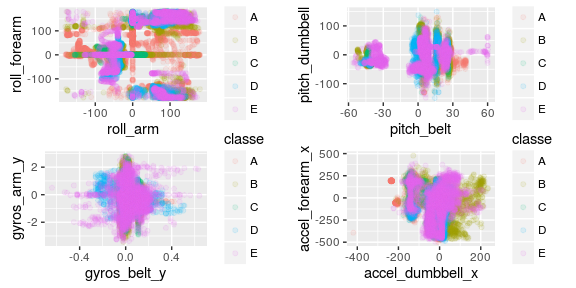

# Human Activity Recognition: Weight Lifting Exercise Prediciton


## Introduction
Human Activity Recognition - HAR - has emerged as a key research area in the last years and is gaining increasing attention by the pervasive computing research community (For further information please read [here](http://groupware.les.inf.puc-rio.br/har )). Based on the data obtained from [Velloso and collaborators, 2013](http://groupware.les.inf.puc-rio.br/work.jsf?p1=11201), where six young health participants were asked to perform one set of 10 repetitions of the Unilateral Dumbbell Biceps Curl in five different fashions: exactly according to the specification (Class A), throwing the elbows to the front (Class B), lifting the dumbbell only halfway (Class C), lowering the dumbbell only halfway (Class D) and throwing the hips to the front (Class E), **we will try to build a machine learning algorithm** to predict the manner in which these six individuals did the exercises.  
Since the data set provided [here](https://d396qusza40orc.cloudfront.net/predmachlearn/pml-training.csv) for the trainning data and [here](https://d396qusza40orc.cloudfront.net/predmachlearn/pml-testing.csv) for the test data, are quite messy we will be doing some "cleaning" to allow us to perform exploratory analysis and apply different algorithms such as *rpart*, *random fores*, *Linear Discriminant Analysis* and combinations to get the one with the highest accuracy which will allow us to apply this algorithm to the test data set.  


## Data cleaning and exploratory analysis
1. Both datasets downloaded and loaded in R contain 160 variables! most of them are filled with NA values, DIV/o or nothing, that is why we added the argument *na.strings* in our *read.csv* function. The first step will be to remove those NA values in our data sets:  

```r
train <- train[, colSums(is.na(train)) == 0]
test <- test[, colSums(is.na(test)) == 0]
```
2. The next step would be to gather all the meaningful variables measured in the [Weight Lifting Exercises analysis](http://groupware.les.inf.puc-rio.br/har#weight_lifting_exercises), which includes arm, belt, forearm, and dumbbell sensors measurements (we will also include our outcome the variable *classe*).  

```r
train <- subset(train, select = c(grep("arm", colnames(train)), grep("belt", colnames(train)), grep("classe", colnames(train)), grep("dumbbell", colnames(train)), grep("forearm", colnames(train))))
test <- subset(test, select = c(grep("arm", colnames(test)), grep("belt", colnames(test)), grep("classe", colnames(test)), grep("dumbbel", colnames(test)), grep("forearm", colnames(test))))
```
Once these steps are done, we are presented with a *train* and *test* databases of 66 variables, we will conduct further exploratory analysis to discard more varibels (if possible) that will not help us to buil up our algorithm. 

3. We will plot some of the variables to see if there is some pattern that allows us to pick important predictors for the outcome *classe*. Here we present some of the plots (see code in appendix section 2) made to see such trends (if present):  

<!-- -->

We failed to see any clear pattern between variables and the outcome *classe*. To further analyse these results, we performed a *near Zero variable* to see if any of the variables left can be excluded as predictors.  


```r
ZeroVar <- nearZeroVar(train[, -40], saveMetrics = TRUE)
```
If we analyse which variables have a near Zero variable value we fail to identify any of the 65 variables as non-important variables for the prediction analysis (full table in appendix section 3):  

```r
which(ZeroVar$nzv == FALSE)
```

```
##  [1]  1  2  3  4  5  6  7  8  9 10 11 12 13 14 15 16 17 18 19 20 21 22 23
## [24] 24 25 26 27 28 29 30 31 32 33 34 35 36 37 38 39 40 41 42 43 44 45 46
## [47] 47 48 49 50 51 52 53 54 55 56 57 58 59 60 61 62 63 64 65
```

**Thus all 65 variables will be used as predictors in our analysis.**

## Building the machine learning algorithm
To predict our outcome *class* we will be using 65 different predictors, and we will apply prediction algorithm based in tree and linear discrimination analysis. First we will split our *train* dataset in order to build the model and test the prediction models.

```r
# Spliting the data
inTrain <- createDataPartition(train$classe, p = 0.7, list = FALSE)
training <- train[inTrain, ]
testing <- train[-inTrain, ]
```

1. Linear Discrimination analysis. We will fit this model to our *training* data set, we will also use crossvalidation. We have set up the value to 10, since the accuracy of the model does not improve with values of 5 or 20 (it is actually a bit better as 10) and all of them give an **accuracy of 70%**.

```r
modFit <- train(classe ~ ., data = training, method = "lda", trControl = trainControl(method = "cv", number = 10))
pred <- predict(modFit, testing)
```

2. Prediction with trees. Here we will be using two different models the classification tree and the Random Forest. The random Forest method was addressed via the train() function and the randomForest() function. Since the train() function gave us a really high computation time we adopted the randomForest() method.

```r
# Classification tree
modFit2 <- train(classe ~ ., data = training, method = "rpart", trControl = trainControl(method = "cv", number = 10))
pred2 <- predict(modFit2, testing)
# Random Forest
library(randomForest)
modFit4 <- randomForest(classe ~ ., data = training, method = "class")
pred4 <- predict(modFit4, testing, type = "class")
```

```r
# Also tried rf method in train() function
modFit3 <- train(classe ~ ., data = training, method = "rf", trControl = trainControl(method = "cv", number = 10))
pred3 <- predict(modFit3, testing)
```

3. Since the accuracies in both *lda* and *rpart* methods were not high enough, we tried to combine both methods in order to get a better predictive algorithm.

```r
#Combination of predictions
predDF <- data.frame(pred, pred2, classe = testing$classe)
combmodFit <- train(classe ~ ., method = "gam", data = predDF)
combPred <- predict(combmodFit, predDF)
```

Finally we compared all the predicition algorith and check which one gave us the highest accuracy to use in our final prediction of the Testing Data:


```r
# Linear Discrimination Analysis
confusionMatrix(pred, testing$classe)$table; confusionMatrix(pred, testing$classe)$overall
```

```
##           Reference
## Prediction    A    B    C    D    E
##          A 1391  169  110   60   44
##          B   28  729   83   39  173
##          C  148  154  683  112   91
##          D  104   41  135  715  103
##          E    3   46   15   38  671
```

```
##       Accuracy          Kappa  AccuracyLower  AccuracyUpper   AccuracyNull 
##   7.118097e-01   6.350865e-01   7.000500e-01   7.233590e-01   2.844520e-01 
## AccuracyPValue  McnemarPValue 
##   0.000000e+00   4.403339e-66
```

```r
# Classification tree
confusionMatrix(pred2, testing$classe)$table; confusionMatrix(pred2, testing$classe)$overall
```

```
##           Reference
## Prediction    A    B    C    D    E
##          A 1500  469  484  433  149
##          B   27  377   35  184  138
##          C  121  293  507  347  295
##          D    0    0    0    0    0
##          E   26    0    0    0  500
```

```
##       Accuracy          Kappa  AccuracyLower  AccuracyUpper   AccuracyNull 
##   4.900595e-01   3.338804e-01   4.772101e-01   5.029187e-01   2.844520e-01 
## AccuracyPValue  McnemarPValue 
##  2.741558e-242            NaN
```

```r
# Combination of lda and rpart
confusionMatrix(combPred, testing$classe)$table; confusionMatrix(combPred, testing$classe)$overall
```

```
##           Reference
## Prediction    A    B    C    D    E
##          A 1310  113   27   42   15
##          B  364 1026  999  922 1067
##          C    0    0    0    0    0
##          D    0    0    0    0    0
##          E    0    0    0    0    0
```

```
##       Accuracy          Kappa  AccuracyLower  AccuracyUpper   AccuracyNull 
##   3.969414e-01   2.299848e-01   3.844099e-01   4.095751e-01   2.844520e-01 
## AccuracyPValue  McnemarPValue 
##   9.659494e-77            NaN
```

```r
# Random Forest
confusionMatrix(pred4, testing$classe)$table; confusionMatrix(pred4, testing$classe)$overall
```

```
##           Reference
## Prediction    A    B    C    D    E
##          A 1673    6    0    0    0
##          B    1 1130    3    0    0
##          C    0    3 1021    9    0
##          D    0    0    2  954    1
##          E    0    0    0    1 1081
```

```
##       Accuracy          Kappa  AccuracyLower  AccuracyUpper   AccuracyNull 
##      0.9955820      0.9944112      0.9935332      0.9971120      0.2844520 
## AccuracyPValue  McnemarPValue 
##      0.0000000            NaN
```

The **Random Forest model yields a 99% accuracy** and it is overall our best prediction model. Thus we will be using this model to predict the testing data base:

```r
predict(modFit4, test, type = "class")
```

```
##  1  2  3  4  5  6  7  8  9 10 11 12 13 14 15 16 17 18 19 20 
##  B  A  B  A  A  E  D  B  A  A  B  C  B  A  E  E  A  B  B  B 
## Levels: A B C D E
```

## Appendix
### Section 1. Downloading the data and loading in R

```r
fileURL <- "https://d396qusza40orc.cloudfront.net/predmachlearn/pml-training.csv" #traininbg set
fileURL2 <- "https://d396qusza40orc.cloudfront.net/predmachlearn/pml-testing.csv" #test set

if(!file.exists("./pml-training.csv")) {
  download.file(fileURL, destfile = "pml-training.csv")
}

if(!file.exists("./pml-testing.csv")) {
  download.file(fileURL2, destfile = "./pml-testing.csv")
}

# Loading data into R
# Since the original data sets have many fields which are blank or have errors, we used the na.strings argument in read.csv to make all of them consistent. 
train <- read.csv("pml-training.csv", na.strings = c("NA", "#DIV/0", ""))
test <- read.csv("pml-testing.csv", na.strings = c("NA", "#DIV/0", ""))
```

### Section 2. Exploratory plots

```r
library(ggplot2)
library(gridExtra)
g1 <- qplot(data = train,  x = roll_arm, y = roll_forearm, color = classe, alpha = I(1/10))
g2 <- qplot(data = train, x = pitch_belt, y = pitch_dumbbell, color = classe, alpha = I(1/10))
g3 <- qplot(data = train, x = gyros_belt_y, y = gyros_arm_y, color = classe, alpha = I(1/10))
g4 <- qplot(data = train, x = accel_dumbbell_x, y = accel_forearm_x, color = classe, alpha = I(1/10))
grid.arrange(g1, g2, g3, g4, ncol = 2, nrow = 2)
```

### Section 3. Nera Zero Variable Table:

```
##                       freqRatio percentUnique zeroVar   nzv
## roll_arm              52.338462    13.5256345   FALSE FALSE
## pitch_arm             87.256410    15.7323412   FALSE FALSE
## yaw_arm               33.029126    14.6570176   FALSE FALSE
## total_accel_arm        1.024526     0.3363572   FALSE FALSE
## gyros_arm_x            1.015504     3.2769341   FALSE FALSE
## gyros_arm_y            1.454369     1.9162165   FALSE FALSE
## gyros_arm_z            1.110687     1.2638875   FALSE FALSE
## accel_arm_x            1.017341     3.9598410   FALSE FALSE
## accel_arm_y            1.140187     2.7367241   FALSE FALSE
## accel_arm_z            1.128000     4.0362858   FALSE FALSE
## magnet_arm_x           1.000000     6.8239731   FALSE FALSE
## magnet_arm_y           1.056818     4.4439914   FALSE FALSE
## magnet_arm_z           1.036364     6.4468454   FALSE FALSE
## roll_forearm          11.589286    11.0895933   FALSE FALSE
## pitch_forearm         65.983051    14.8557741   FALSE FALSE
## yaw_forearm           15.322835    10.1467740   FALSE FALSE
## total_accel_forearm    1.128928     0.3567424   FALSE FALSE
## gyros_forearm_x        1.059273     1.5187035   FALSE FALSE
## gyros_forearm_y        1.036554     3.7763735   FALSE FALSE
## gyros_forearm_z        1.122917     1.5645704   FALSE FALSE
## accel_forearm_x        1.126437     4.0464784   FALSE FALSE
## accel_forearm_y        1.059406     5.1116094   FALSE FALSE
## accel_forearm_z        1.006250     2.9558659   FALSE FALSE
## magnet_forearm_x       1.012346     7.7667924   FALSE FALSE
## magnet_forearm_y       1.246914     9.5403119   FALSE FALSE
## magnet_forearm_z       1.000000     8.5771073   FALSE FALSE
## roll_belt              1.101904     6.7781062   FALSE FALSE
## pitch_belt             1.036082     9.3772296   FALSE FALSE
## yaw_belt               1.058480     9.9734991   FALSE FALSE
## total_accel_belt       1.063160     0.1477933   FALSE FALSE
## gyros_belt_x           1.058651     0.7134849   FALSE FALSE
## gyros_belt_y           1.144000     0.3516461   FALSE FALSE
## gyros_belt_z           1.066214     0.8612782   FALSE FALSE
## accel_belt_x           1.055412     0.8357966   FALSE FALSE
## accel_belt_y           1.113725     0.7287738   FALSE FALSE
## accel_belt_z           1.078767     1.5237998   FALSE FALSE
## magnet_belt_x          1.090141     1.6664968   FALSE FALSE
## magnet_belt_y          1.099688     1.5187035   FALSE FALSE
## magnet_belt_z          1.006369     2.3290184   FALSE FALSE
## roll_dumbbell          1.022388    84.2065029   FALSE FALSE
## pitch_dumbbell         2.277372    81.7449801   FALSE FALSE
## yaw_dumbbell           1.132231    83.4828254   FALSE FALSE
## total_accel_dumbbell   1.072634     0.2191418   FALSE FALSE
## gyros_dumbbell_x       1.003268     1.2282132   FALSE FALSE
## gyros_dumbbell_y       1.264957     1.4167771   FALSE FALSE
## gyros_dumbbell_z       1.060100     1.0498420   FALSE FALSE
## accel_dumbbell_x       1.018018     2.1659362   FALSE FALSE
## accel_dumbbell_y       1.053061     2.3748853   FALSE FALSE
## accel_dumbbell_z       1.133333     2.0894914   FALSE FALSE
## magnet_dumbbell_x      1.098266     5.7486495   FALSE FALSE
## magnet_dumbbell_y      1.197740     4.3012945   FALSE FALSE
## magnet_dumbbell_z      1.020833     3.4451126   FALSE FALSE
## roll_forearm.1        11.589286    11.0895933   FALSE FALSE
## pitch_forearm.1       65.983051    14.8557741   FALSE FALSE
## yaw_forearm.1         15.322835    10.1467740   FALSE FALSE
## total_accel_forearm.1  1.128928     0.3567424   FALSE FALSE
## gyros_forearm_x.1      1.059273     1.5187035   FALSE FALSE
## gyros_forearm_y.1      1.036554     3.7763735   FALSE FALSE
## gyros_forearm_z.1      1.122917     1.5645704   FALSE FALSE
## accel_forearm_x.1      1.126437     4.0464784   FALSE FALSE
## accel_forearm_y.1      1.059406     5.1116094   FALSE FALSE
## accel_forearm_z.1      1.006250     2.9558659   FALSE FALSE
## magnet_forearm_x.1     1.012346     7.7667924   FALSE FALSE
## magnet_forearm_y.1     1.246914     9.5403119   FALSE FALSE
## magnet_forearm_z.1     1.000000     8.5771073   FALSE FALSE
```

